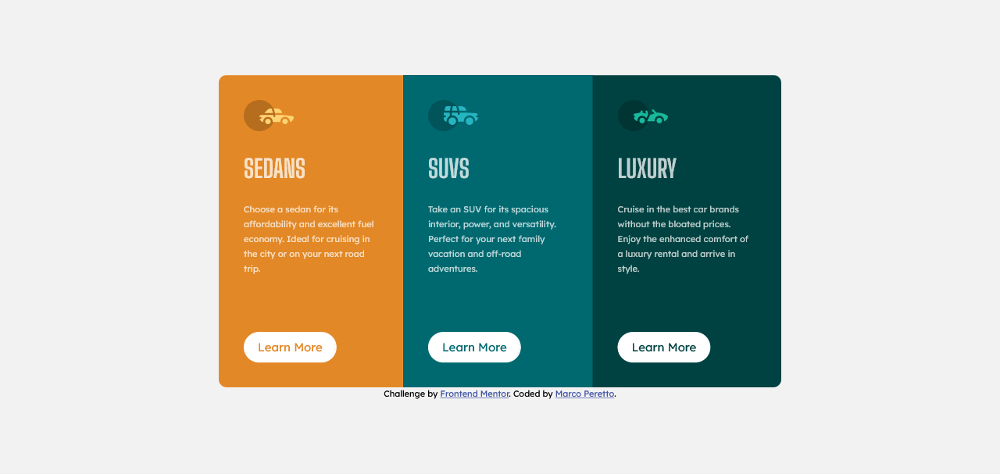

# Frontend Mentor - 3-column preview card component solution

This is a solution to the [3-column preview card component challenge on Frontend Mentor](https://www.frontendmentor.io/challenges/3column-preview-card-component-pH92eAR2-). Frontend Mentor challenges help you improve your coding skills by building realistic projects. 

## Table of contents

- [Overview](#overview)
  - [The challenge](#the-challenge)
  - [Screenshot](#screenshot)
  - [Links](#links)
- [My process](#my-process)
  - [Built with](#built-with)
  - [What I learned](#what-i-learned)
  - [Continued development](#continued-development)
  - [Useful resources](#useful-resources)
- [Author](#author)

## Overview

### The challenge

Users should be able to:

- View the optimal layout depending on their device's screen size
- See hover states for interactive elements

### Screenshot
Desktop version

Mobile version


### Links

- Solution URL: [Solution](https://www.frontendmentor.io/solutions/3-column-card-using-sass-and-css-flex-property-W4Dd4KhVz)
- Live Site URL: [netlify site](https://3-column-preview-card-component-challenge.netlify.app/)

## My process

### Built with

- Semantic HTML5 markup
- CSS custom properties
- Flexbox
- SASS / SCSS preprocessor
- Mobile-first workflow

### What I learned

Use of nth-child selector
```css
&:nth-child(1) {
    background: var(--bright-orange);
    .btn {
        color: var(--bright-orange);
    }
}
```

### Continued development

I'll continue to improve my skill with CSS Flexbox and frontend development in general.

### Useful resources

- [Flexbox guide](https://css-tricks.com/snippets/css/a-guide-to-flexbox/)

## Author

- Linkedin - [Marco Peretto](https://www.linkedin.com/in/marco-peretto/)
- Frontend Mentor - [@mperetto](https://www.frontendmentor.io/profile/mperetto)
